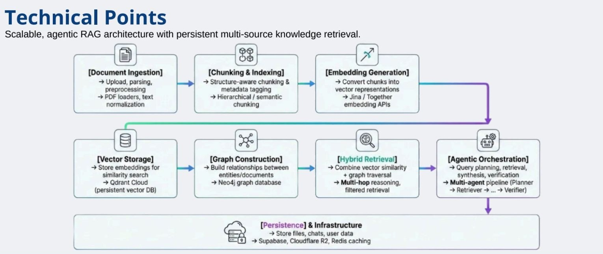

# Industrial Mind OS: Unified Asset & Operations Brain



**Industrial Mind OS** is an elite, AI-powered Industrial Knowledge Intelligence platform designed to solve the "Knowledge Cliff" in asset-intensive industries. This platform ingests heterogeneous industrial documents (P&IDs, maintenance records, safety procedures, OEM manuals, inspection reports) and transforms them into a living, queryable, and proactive intelligence engine.

It eliminates the fragmentation of operating across multiple disconnected document systems and empowers Field Technicians and Plant Engineers with instant, highly accurate answers backed by compliance evidence and proactive alerts.

---

## 🚀 Core Capabilities & Feature Deep-Dive

### 1. Universal Document Ingestion & Synchronization
Industrial Mind OS acts as a central repository that reads any format an industrial plant uses:
*   **Multi-Format Support:** Natively supports PDF, DOCX, TXT, PPTX, and **CSV** (for structured maintenance logs and spreadsheets). PDF extraction additionally repairs the "s p a c e d   o u t" character-spacing artifact common in exported engineering documents.
*   **Computer Vision OCR (Gemini):** Uploaded `.png`, `.jpg`, and `.jpeg` files are routed to Google's multimodal `gemini-2.5-pro` model, which extracts text, measurements, valve labels, and structural metadata directly from P&IDs and scanned engineering drawings.
*   **Confluence Enterprise Sync:** Securely connects to enterprise Confluence Cloud workspaces (REST API + email/API-token basic auth), converts pages to markdown, and feeds them through the same ingestion pipeline as file uploads.
*   **Dual Ingestion Paths:** Documents under 15,000 characters are injected straight into the knowledge cache (instantly queryable, no embedding latency). Larger documents are semantically chunked — split on sentence boundaries wherever embedding similarity between consecutive sentences drops below a threshold — embedded, and indexed in the background.
*   **Smart Deletion Pipeline:** Deleting a document from the UI scrubs it from all three stores in lockstep — the vector database (Qdrant), the knowledge cache, and the graph database — pruning orphaned nodes and edges to prevent "ghost data." Re-uploading a file replaces its previous index rather than duplicating it.

### 2. Multi-Modal Agentic Chat (The Knowledge Copilot)
A LangGraph conversational AI orchestrator that mimics human problem-solving:
*   **Triple-Mode RAG Architecture:**
    *   *Private Mode:* Strict zero-hallucination querying using ONLY internally uploaded engineering documents.
    *   *Hybrid Mode:* Searches internal documents first, then dynamically searches the live internet (via Tavily/Firecrawl/DuckDuckGo) to supplement missing specs.
    *   *Live Web Mode:* Acts as a live industrial research assistant, bypassing internal data entirely.
*   **Document Gating (Source Selection):** Users can explicitly select which manuals or logs the AI should restrict its search to for a specific chat. The allowlist filters the knowledge cache, the vector search, and the graph traversal simultaneously.
*   **Self-Correcting Agent Loop:** A heuristic verifier scores every answer on refusal signals, length, citation density, and structure. Low-confidence answers are routed back to the planner for a second retrieval attempt before being returned.
*   **Agentic Thought Process Viewer:** The AI breaks down its LangGraph workflow (Planner → Adaptive Retrieval → Web Search → Memory Builder → Synthesizer → Verifier) inside the chat bubble, building trust with engineers by showing *how* it reached its conclusion.
*   **Rich UI Rendering:** The chat natively renders Markdown, code blocks, and dynamic HTML/Tailwind dashboards directly inside the conversation.

### 3. Retrieval Insight Panel
A persistent right-hand sidebar that acts as the transparent "brain scan" of the AI:
*   **Heuristic Confidence Scoring:** Calculates a real-time confidence percentage (graded dynamically on context quality, lack of refusal signals, and citation density) displayed as a color-coded progress bar.
*   **Retrieval Strategy:** Informs the user exactly which retrieval strategy was deployed for the query.
*   **Verified Citations:** Lists the exact source documents utilized. Inside the chat, these citations render as clickable buttons.
*   **Historical Message Memory:** Clicking any previous message instantly updates the Insight Panel to show the confidence and sources for that specific historical interaction.

### 4. Proactive Auditor Engine (Background Intelligence)
An asynchronous agent that transforms the platform from "reactive" to "proactive":
*   **Continuous Scanning:** Whenever a new document (e.g., a daily maintenance log) is ingested — by either the direct-injection or the embedded path — the Auditor Engine silently scans it against the existing knowledge cache.
*   **Compliance Gap Detection:** Automatically detects if a new log violates a safety limit specified in an older OEM manual.
*   **Historical Pattern Recognition:** Identifies if a new symptom matches a near-miss incident report from years ago.
*   **Push Notifications (Bell System):** Triggers a red flashing notification bell in the UI, dropping down a detailed alert warning the engineering team before a catastrophic failure occurs. Alerts persist to disk, so findings survive a backend restart.

### 5. Quality & Regulatory Compliance Export
Built specifically for Quality Management System (QMS) integration and auditing:
*   **Export Audit Report:** With a single click at the bottom of any AI response, the system strips out raw code and UI elements, formatting the Root Cause Analysis (RCA) and its cited sources into a beautifully styled HTML layout.
*   **Native PDF Evidence:** Instantly triggers the browser's native print engine to allow technicians to "Save as PDF", producing a professional, timestamped Audit Evidence Package for regulatory inspectors.

### 6. The Asset Relationship Graph (Topology Visualizer)
A visual explorer for complex industrial ontologies:
*   **Automated Graph Extraction:** As documents are indexed, a NetworkX graph database automatically constructs a keyword co-occurrence network across every chunk, tagging each edge with its source filename so relationships stay traceable back to the originating document.
*   **Interactive Force-Directed Visualization:** A physics-driven 2D graph (`react-force-graph-2d`) rendered in the sidebar.
*   **Browser Crash Safeguards:** Intelligently caps rendering at the Top 300 nodes by connection degree to ensure the frontend remains buttery smooth even when thousands of documents are ingested.

---

## 🛠️ Technology Stack

**Frontend:**
*   React.js + Vite
*   Tailwind CSS (Glassmorphism & Industrial UI Design)
*   Framer Motion (Animation)
*   Lucide React (Iconography)
*   React Markdown + remark-gfm (Rich text rendering)
*   react-force-graph-2d (Knowledge graph visualization)

**Backend Intelligence:**
*   FastAPI (Python)
*   LangChain & LangGraph (Multi-Agent Orchestration)
*   Google Gemini via `langchain-google-genai` — `gemini-2.5-pro` for synthesis, vision/OCR, and the Auditor Engine; `gemini-2.5-flash` for fast planning and query refinement
*   HuggingFace `all-MiniLM-L6-v2` (384-dim embeddings, running locally on CPU — no embedding API calls)
*   Qdrant (Vector database for semantic search)
*   NetworkX (Graph database processing)

**Auth & Storage:**
*   SQLite + SQLAlchemy (User accounts)
*   python-jose JWTs + passlib/bcrypt (Local token auth & password hashing)

**Search Augmentation:**
*   Tavily → Firecrawl → DuckDuckGo (Tiered web search fallback chain for Hybrid/Online mode)

### Local-first data layer
There is no external database server to provision. Every store is an embedded process or a plain file inside `backend/`:

| Store | Backing | Location |
| --- | --- | --- |
| Vectors | Qdrant in local disk-persisted mode | `backend/qdrant_data/` |
| Knowledge graph | NetworkX `MultiDiGraph`, JSON-serialized | `backend/graph_db.json` |
| Small-document cache | JSON dict | `backend/memory_cache.json` |
| Users | SQLite | `backend/industrial_mind_os.db` |
| Auditor alerts | JSON list | `backend/alerts.json` |

All of these are gitignored — deleting them resets the platform to a clean slate.

Every store is scoped per user: documents, graph edges, alerts and search results are filtered by the owning account, so one engineer's uploads are never visible or deletable by another. Data written before scoping was introduced carries no owner and stays readable by everyone, rather than being orphaned by the upgrade.

Qdrant's local mode holds an exclusive lock on its directory, so only one backend process can run at a time. Set `QDRANT_URL` to point at a real Qdrant server when you need multiple workers.

---

## ⚙️ Quick Start (Local Development)

### 1. Clone & Setup
```bash
git clone https://github.com/YourUsername/IndustrialMindOS.git
cd IndustrialMindOS
```

### 2. Backend (FastAPI + AI Agents)
```bash
cd backend
python -m venv venv          # CPython 3.11 recommended
venv\Scripts\activate        # Windows

pip install -r requirements.txt

cp .env.example .env         # then fill in your keys (see below)
uvicorn main:app --reload --host 0.0.0.0 --port 8000
```

The first launch downloads the local `all-MiniLM-L6-v2` embedding model, so expect a slower cold start. Once running, the API is documented at `http://localhost:8000/docs`, with a liveness probe at `/health`.

#### Environment variables (`backend/.env`)

**Required:**
*   `GOOGLE_API_KEY` — powers every LLM call: synthesis, planning, web-query refinement, image OCR, and the Auditor Engine. The agent pipeline does not function without it.
*   `JWT_SECRET_KEY` — signs and verifies auth tokens. **The backend refuses to start without it**, so tokens can never be signed with a publicly known key. Generate one with `python -c "import secrets; print(secrets.token_hex(32))"`.

**Optional** (web search degrades gracefully without them):
*   `TAVILY_API_KEY` — primary web search provider for Hybrid/Online mode.
*   `FIRE_CRAWL_API_KEY` — secondary fallback if Tavily is unset or fails.
*   With neither key set, web search falls back to DuckDuckGo, which requires no credentials.

**Optional** (deployment):
*   `CORS_ORIGINS` — comma-separated browser origins allowed to call the API. Defaults to the local Vite dev servers; set it when you deploy the frontend anywhere else.
*   `MAX_UPLOAD_MB` — upload size ceiling (default 25).
*   `QDRANT_URL` / `QDRANT_API_KEY` — use a Qdrant server instead of local disk mode.

### 3. Tests (from `backend/`)
```bash
pip install -r requirements-dev.txt
python -m pytest                        # whole suite
python -m pytest tests/test_scoping.py  # a single file
python -m pytest -k "legacy"            # a single test by name
```
The suite runs fully offline — no API keys, no model download, no Qdrant — covering PDF text repair, the semantic chunk boundaries, the confidence heuristic, and the per-user scoping rules.

### 4. Frontend (React + Vite)
```bash
cd frontend
npm install
npm run dev
```

Set `VITE_API_URL` if your backend is not on `http://localhost:8000`.

---

*Industrial Mind OS — Connecting the dots that no individual team member can connect alone.*
